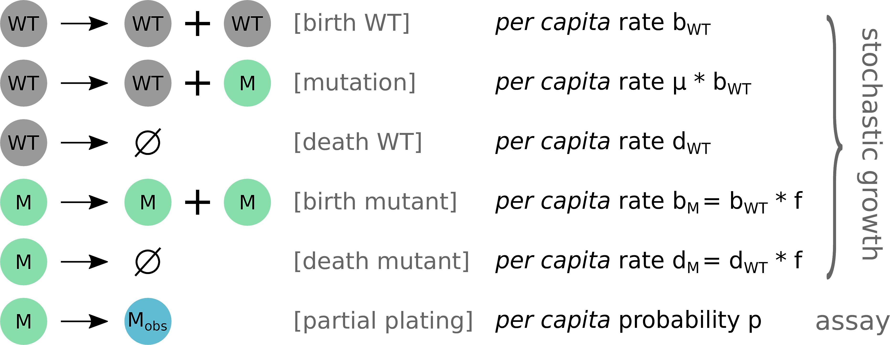

# Inference based on simulations for microbial evolution

This project focuses on the application of modern statistical inference techniques, such as Approximate Bayesian Computing, to address a central question in biology: the dynamics of genetic diversity generation (mutagenesis) in bacterial populations (e.g., the generation of a variant conferring increased antibiotic resistance)."

The approaches typically used to characterize this generation of genetic diversity rely on estimating the mutation rate from simple in vitro laboratory experiments. This estimation is achieved through maximum likelihood using a simple analytical model.

However, this model is overly simplistic, meaning it makes overly restrictive assumptions and cannot address open questions in microbial evolution. Notably, it lacks the ability to consider:

- The complex ecology characterizing the natural environment where bacteria typically reside (e.g., within a complex microbiome and within a host with an immune system, rather than in a test tube.)

- Potential antibiotic treatment

- The potential effects of mutations on growth dynamics

To overcome the limitations of this historical model, we propose the use of simulations that incorporate these various extensions to the standard model. Inference of different parameters from experimental data can then be accomplished using approximate Bayesian computing (ABC) methods. In brief, these methods determine which simulation parameters bring the model closest to experimental data while considering constraints such as parsimony (not invoking the simulator more than necessary), convergence, and confidence intervals.

Therefore, a super-fast simulator has been developed (three orders of magnitude faster than the state of the art), capable of overcoming the limitations of the historical model detailed above and simulating arbitrarily complex ecological dynamics. This project will build upon this simulator, aiming to develop a fast and efficient inference method that outperforms the current state of the art.

For more details, please refer to a more comprehensive scientific summary in atreyu_short.pdf."

# Description du modèle biologique

